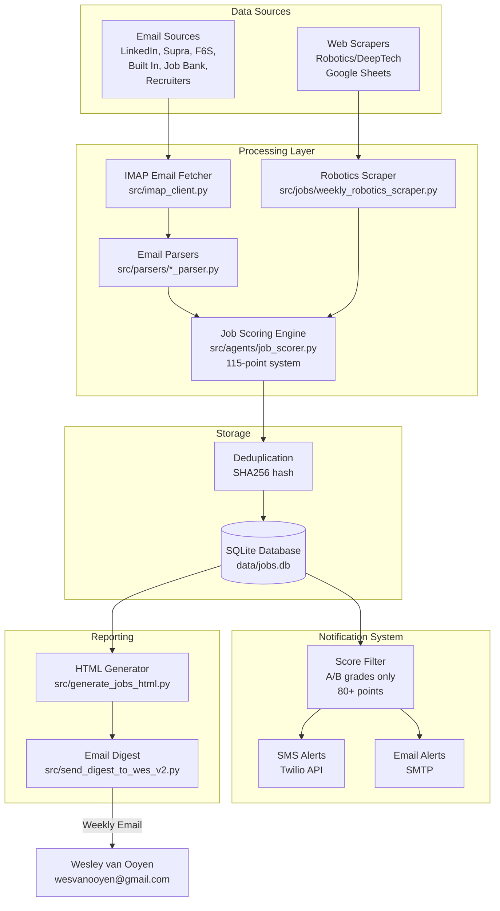
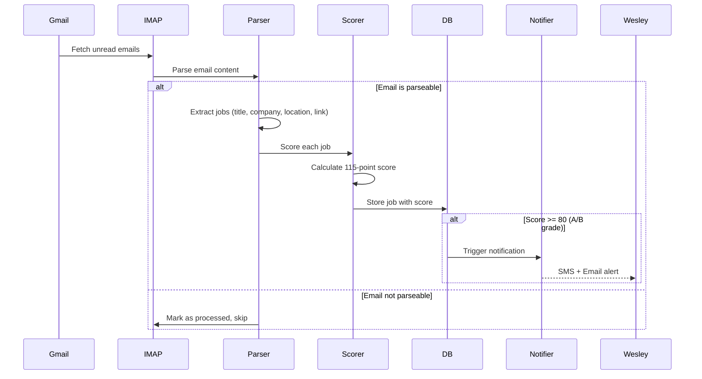
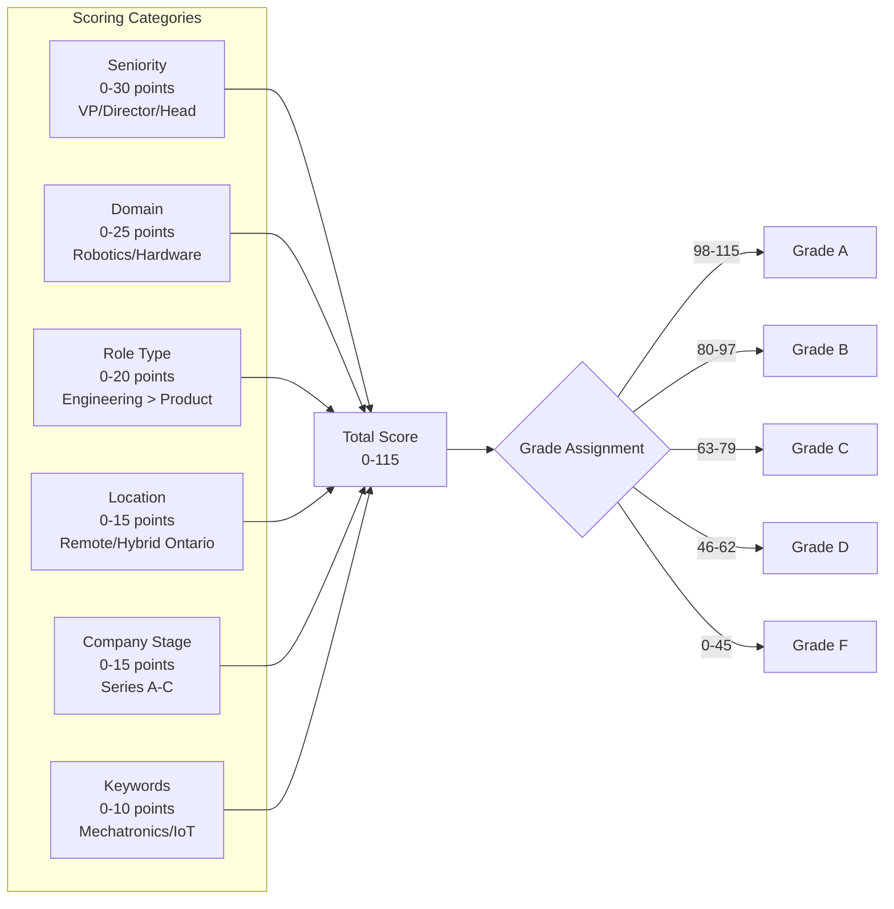
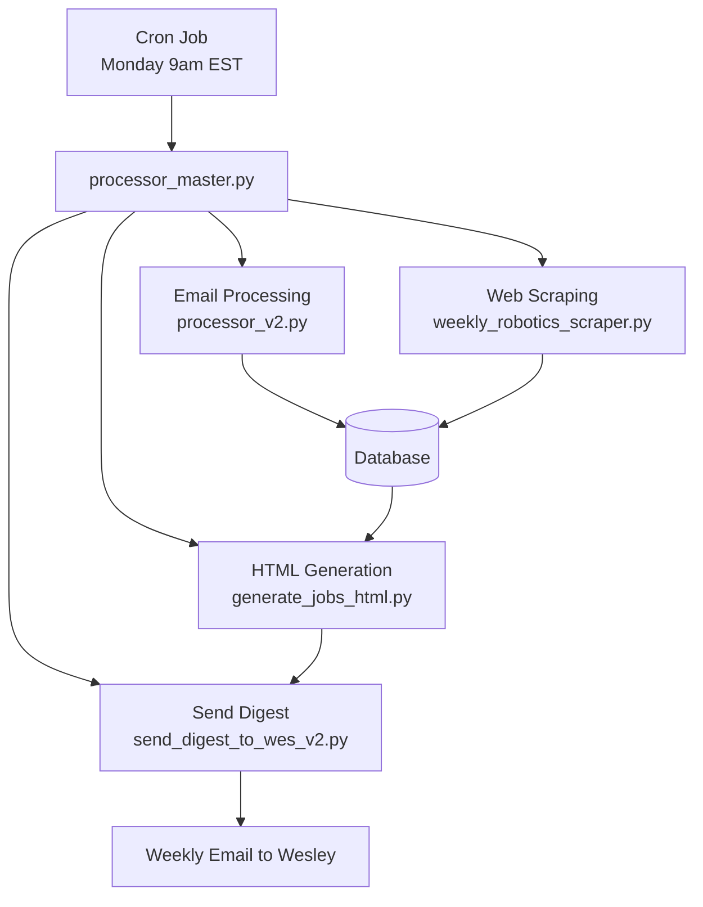
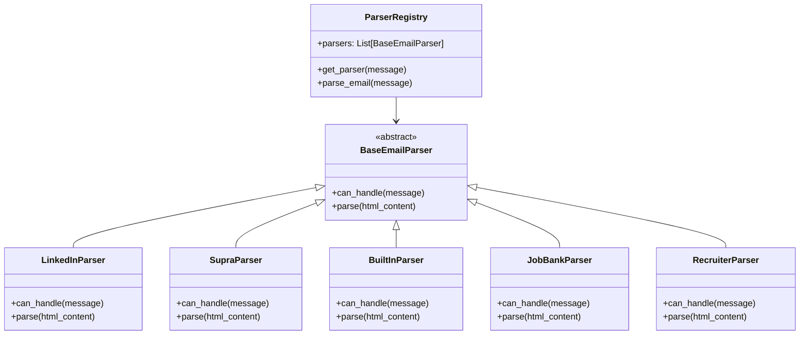
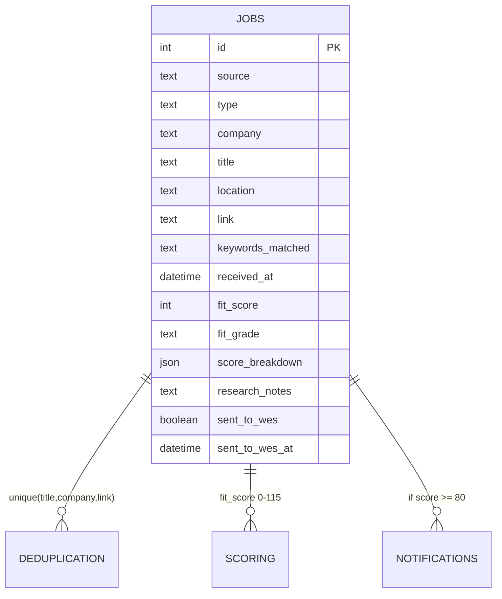

# Job Agent Workflow Diagram

## System Architecture Overview

## Detailed Process Flow

### 1. Email Processing Pipeline

### 2. Job Scoring System (115 points)

### 3. Weekly Automation (Cron)

### 4. Parser Registry Pattern

### 5. Database Schema

## Key Components

### Input Sources
1. **Email Parsers** (6 active):
   - LinkedIn Job Alerts
   - Supra Product Leadership Newsletter
   - F6S Startup Jobs
   - Built In Tech Jobs
   - Canadian Job Bank (Mechanical Engineering)
   - Direct Recruiter Emails

2. **Web Scrapers**:
   - Robotics/DeepTech Google Sheets (1,092 jobs/week)
   - Filters for Director+ roles
   - B+ grade threshold (70+ score)

### Processing Pipeline
1. **IMAP Email Fetching** - Monitors dedicated Gmail account
2. **Parser Selection** - Registry pattern matches parser to email type
3. **Job Extraction** - HTML parsing with BeautifulSoup
4. **Scoring Engine** - 115-point profile matching system
5. **Deduplication** - SHA256 hash of (title, company, link)
6. **Storage** - SQLite with tracking of sent status

### Output Channels
1. **Real-time Notifications** (A/B grades only):
   - SMS via Twilio
   - Email alerts via SMTP

2. **Weekly Digest**:
   - HTML report with interactive filtering
   - Sent Monday mornings
   - Only includes unsent jobs
   - Grouped by score grade

### Automation
- **Cron Job**: Runs weekly_robotics_scraper.py every Monday 9am
- **Master Pipeline**: processor_master.py orchestrates all components
- **Duplicate Prevention**: Tracks sent_to_wes status in database

## Performance Metrics

- **Volume**: ~50 jobs/week processed
- **Quality**: 10-15% score 70+ (B grade or better)
- **Top Source**: Robotics scraper (10 B+ jobs vs 0 from newsletters)
- **Noise Reduction**: 80+ score threshold for notifications
- **Delivery**: 100% weekly digest delivery rate
